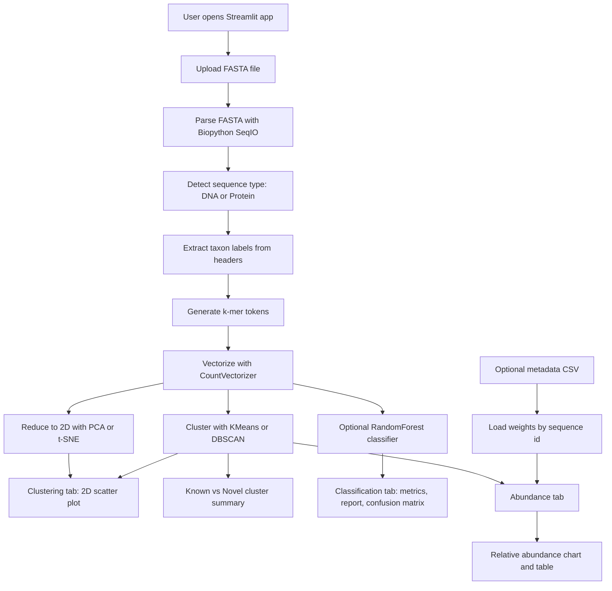

# SeaQuence

[](#technology-stack)
[](#technology-stack)
[](#model-details)
[](#license)

## Overview

SeaQuence is a Streamlit prototype for exploring biological sequence datasets from FASTA files. It parses DNA or protein sequences, converts them into k-mer bag-of-token features, clusters the resulting embeddings, visualizes the clusters in 2D, identifies clusters without known taxonomic labels as potential novel groups, and optionally trains a lightweight RandomForest classifier on known taxa.

The project is useful for researchers, students, and bioinformatics developers who want an interactive, database-independent starting point for sequence clustering, biodiversity exploration, and proof-of-concept taxonomic classification.

## Features

- Upload and parse FASTA files with common extensions: `.fa`, `.fasta`, `.fna`, `.faa`, and `.fas`.
- Automatically classify each sequence as DNA or protein using alphabet-based heuristics.
- Extract taxonomic labels from FASTA headers using bracketed or parenthesized labels, such as `[Homo sapiens]`.
- Generate overlapping k-mers with separate configurable k values for DNA and protein sequences.
- Vectorize k-mer tokens with scikit-learn `CountVectorizer`.
- Reduce high-dimensional sequence features to 2D with PCA or t-SNE.
- Cluster sequences with KMeans or DBSCAN.
- Summarize known versus potentially novel clusters.
- Train an optional RandomForest classifier on sequences with known taxonomic labels.
- Display classification accuracy, class count, test size, classification report, confusion matrix, and example predictions.
- Upload optional metadata CSV files for abundance weighting.
- Compute and visualize cluster-level relative abundance.
- Includes `pdbaa.fa` as a sample FASTA-style input file.

## Technology Stack

| Category | Tools |
| --- | --- |
| Language | Python |
| Web UI | Streamlit |
| Data processing | pandas, NumPy |
| Bioinformatics parsing | Biopython `SeqIO` |
| Machine learning | scikit-learn |
| Models and algorithms | CountVectorizer, PCA, t-SNE, KMeans, DBSCAN, RandomForestClassifier |
| Visualization | Matplotlib, Seaborn, Streamlit charts/dataframes |
| Data inputs | FASTA files, optional metadata CSV |
| Databases/APIs | None detected in the repository |

## Project Architecture

SeaQuence is currently implemented as a single Streamlit application in `app.py`. The workflow is linear: uploaded sequence data is parsed, transformed into k-mer features, embedded, clustered, and then displayed across Streamlit tabs.



## Installation

### Prerequisites

- Python 3.9 or newer is recommended.
- A terminal or PowerShell session.
- Git, if cloning from a remote repository.

Dependencies are listed in `requirements.txt`. A pinned lockfile is not currently included.

### Clone Repository

```powershell
git clone <repository-url>
cd SeaQuence
```

If the project is already on your machine:

```powershell
cd C:\Users\Aneesh\Desktop\SeaQuence
```

### Create Virtual Environment

Windows PowerShell:

```powershell
python -m venv .venv
.\.venv\Scripts\Activate.ps1
```

macOS/Linux:

```bash
python -m venv .venv
source .venv/bin/activate
```

### Install Dependencies

```powershell
pip install -r requirements.txt
```

### Run Application

Run the app with Streamlit:

```powershell
streamlit run app.py
```

Do not run the app with `python app.py`. The application uses Streamlit widgets and expects a Streamlit runtime context.

## Usage

1. Start the app:

   ```powershell
   streamlit run app.py
   ```

2. Open the local URL printed by Streamlit, usually `http://localhost:8501`.
3. In the sidebar, upload a FASTA file. You can use the included `pdbaa.fa` sample.
4. Optionally upload a metadata CSV with sequence IDs and abundance weights.
5. Configure tokenization:
   - `k for DNA`: k-mer size for DNA sequences.
   - `k for Protein`: k-mer size for protein sequences.
   - `Max vocabulary`: maximum number of k-mer features.
6. Configure clustering:
   - Choose `KMeans` or `DBSCAN`.
   - Adjust KMeans cluster count or DBSCAN parameters.
7. Choose the 2D embedding method:
   - `PCA` for faster linear projection.
   - `TSNE` for nonlinear visualization.
8. Use the tabs:
   - `Clustering`: inspect the 2D scatter plot and known/novel cluster summary.
   - `Classification`: train and inspect a proof-of-concept RandomForest classifier.
   - `Abundance`: view weighted or unweighted cluster abundance.

## Input Data

### FASTA Input

Supported extensions:

- `.fa`
- `.fasta`
- `.fna`
- `.faa`
- `.fas`

Each FASTA record should include a header and a sequence:

```text
>seq_001 Example sequence [Homo sapiens]
ACGTACGTACGTACGT
>seq_002 Example protein [Escherichia coli]
MTEYKLVVVGAGGVGKSALTIQLIQNHFVDEYDPTIEDSY
```

Parsed FASTA fields:

| Field | Description |
| --- | --- |
| `id` | Sequence identifier parsed by Biopython |
| `description` | Full FASTA header |
| `sequence` | Uppercase sequence string |
| `type` | Heuristic label: `DNA` or `Protein` |
| `taxon` | Extracted from `[taxon]` first, then `(taxon)` as fallback |

### Metadata CSV Input

Metadata is optional. If provided, it should include an `id` column matching FASTA sequence IDs.

Example:

```csv
id,weight
seq_001,10
seq_002,3
```

The sidebar lets users specify the weight column. If the configured column is missing, the app checks common alternatives:

- `weight`
- `abundance`
- `depth`
- `reads`
- `count`

If no usable metadata is provided, every sequence receives a weight of `1.0`.

## Output

SeaQuence displays results inside the Streamlit app. It does not currently write output files to disk.

| Output | Location | Description |
| --- | --- | --- |
| Parse summary | Main page | Number of sequences, DNA count, and protein count |
| Cluster scatter plot | Clustering tab | 2D PCA or t-SNE visualization colored by cluster and styled by sequence type |
| Known/novel summary | Clustering tab | Cluster count, novel cluster count, DBSCAN noise count, and cluster table |
| Classifier metrics | Classification tab | Accuracy, number of classes, test size |
| Classification report | Classification tab | scikit-learn precision/recall/F1 report |
| Confusion matrix | Classification tab | Heatmap of predicted versus true labels |
| Example predictions | Classification tab | Random subset of predicted taxa |
| Abundance chart | Abundance tab | Relative abundance per cluster |
| Abundance table | Abundance tab | Cluster, weighted count, and relative abundance |

## Folder Structure

```text
SeaQuence/
├── app.py
├── pdbaa.fa
├── requirements.txt
└── README.md
```

Notes:

- `app.py` contains the Streamlit UI, parsing logic, feature engineering, clustering, classification, and plotting code.
- `pdbaa.fa` is a sample FASTA-style sequence file.
- `requirements.txt` lists the Python packages needed to run the Streamlit app.
- No test suite, pinned dependency lockfile, license file, or dedicated source package directory was detected.

## Model Details

### Feature Extraction

The app converts biological sequences into overlapping k-mer tokens:

- DNA sequences use the sidebar-configured DNA k value.
- Protein sequences use the sidebar-configured protein k value.
- Tokens are vectorized with a bag-of-k-mers approach using `CountVectorizer`.

### Sequence Type Detection

Sequence type is inferred with a heuristic:

- Characters are compared against a DNA alphabet that includes common ambiguous bases and gaps.
- If at least 85% of the sequence characters match the DNA alphabet, the sequence is labeled `DNA`.
- Otherwise, it is labeled `Protein`.

### Dimensionality Reduction

The app supports:

- `PCA`: fast linear projection to 2D.
- `TSNE`: nonlinear 2D projection for visual exploration.

### Clustering

Supported clustering algorithms:

| Algorithm | Purpose | Configurable Parameters |
| --- | --- | --- |
| KMeans | Partition sequences into a selected number of clusters | Number of clusters |
| DBSCAN | Density-based clustering with noise detection | `eps`, `min_samples` |

Clusters with no extracted taxonomic labels are marked as potential novel clusters.

### Classification

The classification workflow is optional and intended as a proof of concept.

| Item | Details |
| --- | --- |
| Model type | `RandomForestClassifier` |
| Training data | Uploaded sequences with non-empty extracted taxon labels |
| Features | Bag-of-k-mer vectors |
| Minimum labeled data | At least 4 labeled sequences |
| Minimum classes | At least 2 taxonomic classes |
| Split | `train_test_split` with stratification when possible |
| Metrics | Accuracy, confusion matrix, classification report |
| Inference | Predict taxon labels for a random subset of uploaded sequences |

## Configuration

The application is configured through the Streamlit sidebar.

| Setting | Type | Default | Purpose |
| --- | --- | --- | --- |
| FASTA file | File upload | None | Required input sequence file |
| Metadata CSV | File upload | None | Optional abundance weights |
| k for DNA | Number input | `6` | DNA k-mer size |
| k for Protein | Number input | `3` | Protein k-mer size |
| Max vocabulary | Number input | `5000` | Maximum k-mer vocabulary size |
| Algorithm | Selectbox | `KMeans` | Clustering algorithm |
| KMeans clusters | Slider | `8` | Requested KMeans cluster count |
| DBSCAN eps | Slider | `1.2` | DBSCAN neighborhood radius |
| DBSCAN min_samples | Slider | `5` | DBSCAN minimum samples |
| Embedding method | Selectbox | `PCA` | 2D projection method |
| Train classifier | Checkbox | Enabled | Enables RandomForest proof of concept |
| Metadata weight column | Text input | `weight` | Weight column for abundance |

Environment variables are not used by the current codebase.

## Troubleshooting

| Issue | Likely Cause | Solution |
| --- | --- | --- |
| `AttributeError: 'NoneType' object has no attribute 'read'` | The app was run with `python app.py`, or no FASTA file was uploaded | Run `streamlit run app.py` and upload a FASTA file |
| Streamlit says `missing ScriptRunContext` | The file was launched as a normal Python script | Use `streamlit run app.py` |
| `No sequences found in the uploaded FASTA` | File is empty, malformed, or not FASTA-formatted | Verify FASTA headers start with `>` and sequences follow each header |
| Classifier is not trained | Fewer than 4 labeled sequences or fewer than 2 taxa | Use FASTA headers with bracketed taxon labels and enough labeled examples |
| Metadata has no effect | Missing `id` column or unmatched sequence IDs | Ensure metadata IDs match FASTA record IDs |
| Abundance weights are all `1.0` | No metadata file or no recognized weight column | Provide a CSV with `id` and a numeric weight-like column |
| PCA or KMeans errors on tiny datasets | Very small sequence count or feature count | Use more sequences or lower k-mer sizes |
| Empty vocabulary error | Sequences are shorter than the selected k-mer length | Lower `k for DNA` or `k for Protein` |

## Limitations

- This is a prototype, not a validated taxonomic classification pipeline.
- Taxon extraction depends on FASTA header formatting.
- Sequence type detection is heuristic and may misclassify unusual alphabets or mixed-content records.
- K-mer bag-of-token features ignore sequence order beyond local k-mer windows.
- No persistent database, saved model, exported report, or batch output file is implemented.
- No automated tests are included.
- Dependencies are declared in `requirements.txt`, but no pinned dependency lockfile is included.
- The current code includes temporary debug logging for `fasta_file`.
- The t-SNE branch computes an intermediate PCA variable that is not currently used.
- Very small datasets may fail in PCA, t-SNE, KMeans, or vectorization depending on selected parameters.

## Future Enhancements

- Add pinned dependency versions or a lockfile for fully reproducible installation.
- Add automated tests for FASTA parsing, k-mer generation, metadata loading, and clustering edge cases.
- Add downloadable CSV exports for parsed sequences, cluster summaries, predictions, and abundance tables.
- Add robust validation for small datasets before PCA, t-SNE, KMeans, and vectorization.
- Save trained models and fitted vectorizers for reproducible inference.
- Add support for additional sequence metadata fields and richer taxonomic parsing.
- Add configurable random seeds in the UI.
- Add CI checks for linting and tests.
- Add a formal license file.